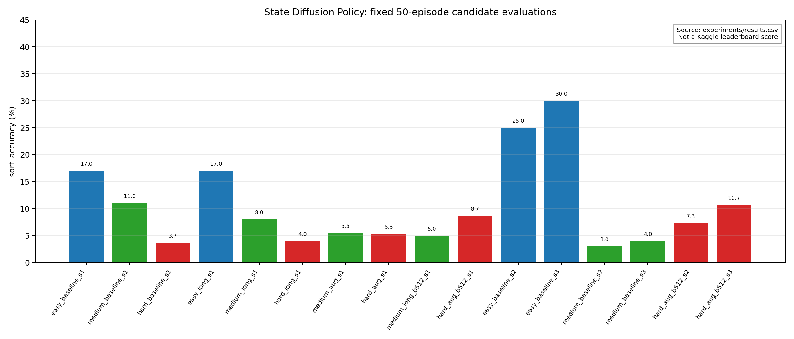
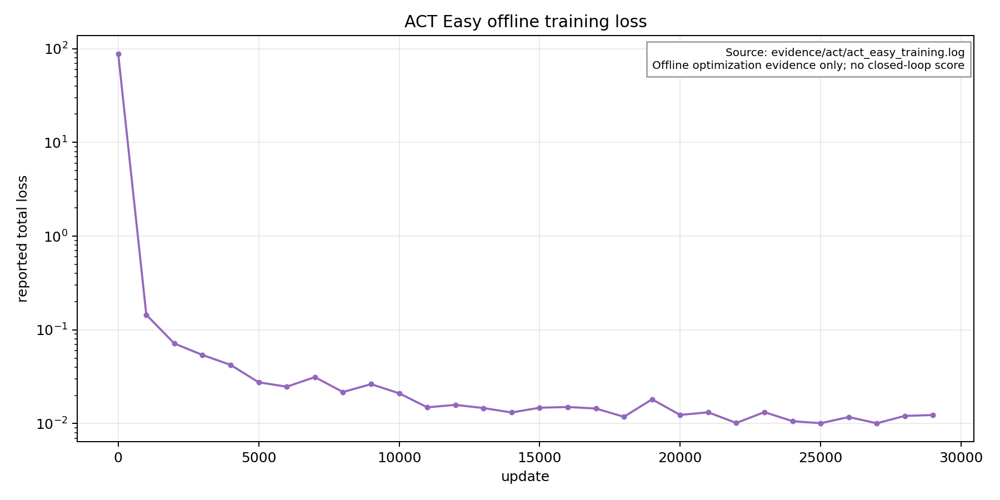
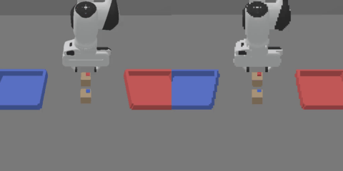
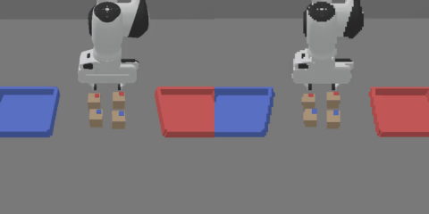
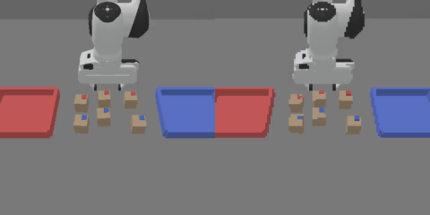

# WarehouseSort：DP 与 ACT 实验档案

这是 WarehouseSort 彩色包裹抓取分拣项目的可复现实验记录：Franka Panda 必须抓取包裹并将其放入标签颜色匹配的箱子。仓库包含可运行任务接入、选定的 State Diffusion Policy（DP）路径、ACT 离线复现、配置、命令、紧凑证据以及未验证结论的明确边界。

目录结构参考 [JereoZero/so101-real](https://github.com/JereoZero/so101-real) 的公开项目写法：先给出结论与演示，再按流程、证据与发布清单展开。DP 使用 privileged state，ACT 使用 RGB 与 proprioception；两者不是算法 leaderboard 对比。

## 已验证结果

以下 DP 成绩均由官方 loader 在 clean shell 中获得：固定 seeds `5000-5049`、50 个 episode、无视频，主指标为 `sort_accuracy`。它们是本地固定 seed 证据，不是 Kaggle held-out leaderboard 结果。

| 赛道 | 观测 | 已完成范围 | 可验证结果 | 证据 |
|---|---|---|---|---|
| State DP | 低维 privileged state | Easy、Medium、Hard | `0.390 / 0.090 / 0.103` | [50-episode 日志](evidence/evaluations/)、[候选 CSV](experiments/results.csv) |
| RGB ACT | scene RGB + proprioception | Easy、30,000 次离线更新 | checkpoint 可加载；无闭环成绩 | [训练日志](evidence/act/act_easy_training.log)、[loss 图](evidence/figures/act_easy_loss.png) |

挑战权重为 Easy/Medium/Hard = `0.20/0.30/0.50`，因此记录的 DP 本地加权值为 `0.1565`：`0.2*0.390 + 0.3*0.090 + 0.5*0.103`。195 MiB 的 submission archive 超出 GitHub 单文件 100 MiB 上限；所有二进制产物均在 [RELEASE_MANIFEST.md](RELEASE_MANIFEST.md) 中以 SHA-256 标识。

## 证据概览

| DP 候选选择 | ACT 离线优化 |
|:---:|:---:|
|  |  |

两张图都来自版本化 CSV/日志，不是 TensorBoard 导出；提供的训练产物压缩包没有 TensorBoard event 文件。来源、重生成命令与解读限制见 [evidence/README.md](evidence/README.md)。

## 任务演示

| Easy：2 个包裹 | Medium：4 个包裹 | Hard：6 个包裹，箱子可能互换 |
|:---:|:---:|:---:|
|  |  |  |

上图 scripted policy 只用于生成示范；提交的 policy 必须是学习到的 observation-to-action 模型。

## 快速复现 State DP

记录的环境为 Python 3.10.16、PyTorch 2.6.0+cu126、ManiSkill 3.0.1、SAPIEN 3.0.3 与 RTX 3090。RGB 评估还需要可用的 NVIDIA Vulkan graphics driver；只有 CUDA compute 不够。

```bash
pixi install
pixi run install
pixi run python il/download_demos.py
pixi run python il/train.py method=dp demo_dir=easy
pixi run python eval.py difficulty=easy \
  policy=warehouse_sort.il_policy:load_dp \
  checkpoint=PATH_TO_CHECKPOINT \
  eval_config=conf/eval/server_50.yaml
```

公开 checkout 不含选定 checkpoint。请从 artifact archive 或 Release 恢复二进制、核验 SHA-256，再运行上述命令；三难度 manifest 位于 [submission.yaml](submission.yaml)。

## 按流程阅读

| 步骤 | 文档 | 内容 |
|---|---|---|
| 1 | [任务与评估](项目流程/01-task-and-evaluation.md) | 成功定义、指标和权重 |
| 2 | [环境](项目流程/02-environment.md) | headless state 设置与 Vulkan 限制 |
| 3 | [数据与协议](项目流程/03-data-and-protocol.md) | 数据审计、seed 与最终评估规则 |
| 4 | [State DP](项目流程/04-state-dp.md) | 配置、候选选择、最终复验与产物 |
| 5 | [RGB ACT](项目流程/05-act.md) | 离线复现参数及无闭环成绩的原因 |
| 6 | [数据目录与命令](项目流程/06-data-layout-and-commands.md) | HDF5/JSON 配对、state/RGB/媒体关系、扩充数据与完整命令 |
| 7 | [发布与提交](项目流程/07-release-and-submission.md) | 恢复、核验、封装和公开方式 |

原始材料见 [实验档案](实验档案/README.md)，公开证据见 [evidence](evidence/README.md)，完整候选结果见 [experiments/results.csv](experiments/results.csv)。

## 证据边界

- DP 用 privileged state，ACT 用 RGB + proprioception，不能据此做算法排名。
- ACT 完成了离线训练和 checkpoint 加载；该主机无法初始化 RGB environment，因此没有成绩不等于得分为零。
- 最终 DP 日志仅证明所述本地 50-episode 条件，不能证明 competition held-out 成绩。
- ACT loss 曲线只证明 30,000 次优化完成，不能证明抓取、放置或分拣成功。

本项目基于 [marso-robotics/berlin-marso-hackathon](https://github.com/marso-robotics/berlin-marso-hackathon) 的 commit `6048f33217f26ae39009a812f53c81171517f393`；请遵守原挑战提交规则与许可证。
